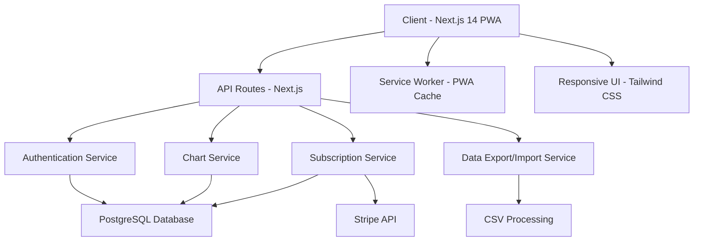

# HappyStats MVP Design Document

## Overview

HappyStats is a mobile-first Progressive Web Application built with Next.js 14 that enables users to create, manage, and analyze personal data through interactive charts. The application follows a tiered subscription model and emphasizes responsive design starting from a 312px viewport. The architecture prioritizes performance, scalability, and user experience while maintaining strict visual consistency through predefined CSS variables.

## Architecture

### High-Level Architecture



### Technology Stack

- **Frontend**: Next.js 14 (App Router), TypeScript, Tailwind CSS
- **Backend**: Next.js API Routes, Node.js runtime
- **Database**: PostgreSQL with connection pooling
- **Authentication**: NextAuth.js with JWT tokens
- **Payments**: Stripe SDK for subscription management
- **Charts**: Chart.js or Recharts for data visualization
- **PWA**: Next.js PWA plugin with service worker
- **Deployment**: Docker container optimized for Coolify

### Database Schema

```sql
-- Users table
CREATE TABLE users (
  id UUID PRIMARY KEY DEFAULT gen_random_uuid(),
  email VARCHAR(255) UNIQUE NOT NULL,
  password_hash VARCHAR(255) NOT NULL,
  subscription_tier VARCHAR(20) DEFAULT 'free',
  subscription_status VARCHAR(20) DEFAULT 'active',
  stripe_customer_id VARCHAR(255),
  created_at TIMESTAMP DEFAULT NOW(),
  updated_at TIMESTAMP DEFAULT NOW()
);

-- Charts table
CREATE TABLE charts (
  id UUID PRIMARY KEY DEFAULT gen_random_uuid(),
  user_id UUID REFERENCES users(id) ON DELETE CASCADE,
  name VARCHAR(255) NOT NULL,
  category VARCHAR(100) NOT NULL,
  created_at TIMESTAMP DEFAULT NOW(),
  updated_at TIMESTAMP DEFAULT NOW()
);

-- Data points table
CREATE TABLE data_points (
  id UUID PRIMARY KEY DEFAULT gen_random_uuid(),
  chart_id UUID REFERENCES charts(id) ON DELETE CASCADE,
  measurement DECIMAL(10,2) NOT NULL,
  date DATE NOT NULL,
  name VARCHAR(255) NOT NULL,
  created_at TIMESTAMP DEFAULT NOW()
);

-- Subscriptions table
CREATE TABLE subscriptions (
  id UUID PRIMARY KEY DEFAULT gen_random_uuid(),
  user_id UUID REFERENCES users(id) ON DELETE CASCADE,
  stripe_subscription_id VARCHAR(255),
  status VARCHAR(20) NOT NULL,
  current_period_start TIMESTAMP,
  current_period_end TIMESTAMP,
  created_at TIMESTAMP DEFAULT NOW()
);
```

## Components and Interfaces

### Core Components Structure

```
src/
├── app/
│   ├── (auth)/
│   │   ├── login/
│   │   └── register/
│   ├── dashboard/
│   ├── chart/[id]/
│   ├── api/
│   │   ├── auth/
│   │   ├── charts/
│   │   ├── subscriptions/
│   │   └── export/
│   └── layout.tsx
├── components/
│   ├── ui/
│   │   ├── Button.tsx
│   │   ├── Input.tsx
│   │   ├── Card.tsx
│   │   └── Modal.tsx
│   ├── charts/
│   │   ├── ChartView.tsx
│   │   ├── ChartEditor.tsx
│   │   └── TrendLine.tsx
│   ├── dashboard/
│   │   ├── ChartGrid.tsx
│   │   ├── SearchFilter.tsx
│   │   └── CreateChartButton.tsx
│   └── layout/
│       ├── Header.tsx
│       ├── Navigation.tsx
│       └── Footer.tsx
├── lib/
│   ├── auth.ts
│   ├── database.ts
│   ├── stripe.ts
│   └── utils.ts
└── types/
    ├── user.ts
    ├── chart.ts
    └── subscription.ts
```

### Key Interface Definitions

```typescript
// User interfaces
interface User {
  id: string;
  email: string;
  subscriptionTier: 'free' | 'monthly' | 'lifetime';
  subscriptionStatus: 'active' | 'canceled' | 'past_due';
  stripeCustomerId?: string;
  createdAt: Date;
}

// Chart interfaces
interface Chart {
  id: string;
  userId: string;
  name: string;
  category: string;
  dataPoints: DataPoint[];
  createdAt: Date;
  updatedAt: Date;
}

interface DataPoint {
  id: string;
  chartId: string;
  measurement: number;
  date: Date;
  name: string;
  createdAt: Date;
}

// Subscription interfaces
interface Subscription {
  id: string;
  userId: string;
  stripeSubscriptionId?: string;
  status: 'active' | 'canceled' | 'past_due';
  currentPeriodStart?: Date;
  currentPeriodEnd?: Date;
}
```

### Mobile-First Component Design

All components will be designed with the following responsive breakpoints:

```css
/* Mobile First - 312px base */
.container {
  width: 100%;
  padding: 0 1rem;
}

/* Small mobile - 375px */
@media (min-width: 375px) {
  .container {
    padding: 0 1.5rem;
  }
}

/* Large mobile - 425px */
@media (min-width: 425px) {
  .container {
    max-width: 425px;
    margin: 0 auto;
  }
}

/* Tablet - 768px */
@media (min-width: 768px) {
  .container {
    max-width: 768px;
    padding: 0 2rem;
  }
}

/* Desktop - 1024px+ */
@media (min-width: 1024px) {
  .container {
    max-width: 1200px;
    padding: 0 3rem;
  }
}
```

## Data Models

### Chart Data Processing

Charts will use a standardized data processing pipeline:

1. **Data Validation**: Ensure all data points have required fields
2. **Trend Calculation**: Use linear regression for trending lines
3. **Date Filtering**: Apply date range filters without mutating original data
4. **Responsive Rendering**: Adapt chart size and labels for mobile viewports

### Trending Line Algorithm

```typescript
interface TrendCalculation {
  slope: number;
  intercept: number;
  rSquared: number;
}

function calculateTrend(dataPoints: DataPoint[]): TrendCalculation {
  // Linear regression implementation
  const n = dataPoints.length;
  const xValues = dataPoints.map((_, index) => index);
  const yValues = dataPoints.map(point => point.measurement);
  
  // Calculate slope and intercept using least squares method
  const sumX = xValues.reduce((a, b) => a + b, 0);
  const sumY = yValues.reduce((a, b) => a + b, 0);
  const sumXY = xValues.reduce((sum, x, i) => sum + x * yValues[i], 0);
  const sumXX = xValues.reduce((sum, x) => sum + x * x, 0);
  
  const slope = (n * sumXY - sumX * sumY) / (n * sumXX - sumX * sumX);
  const intercept = (sumY - slope * sumX) / n;
  
  return { slope, intercept, rSquared: calculateRSquared(dataPoints, slope, intercept) };
}
```

### CSV Import/Export Format

```typescript
interface CSVFormat {
  measurement: number;
  date: string; // ISO 8601 format
  name: string;
  category: string;
}

// Export format
const exportHeaders = ['measurement', 'date', 'name', 'category'];

// Import validation rules
const importValidation = {
  measurement: (value: string) => !isNaN(parseFloat(value)),
  date: (value: string) => !isNaN(Date.parse(value)),
  name: (value: string) => value.trim().length > 0,
  category: (value: string) => value.trim().length > 0
};
```

## Error Handling

### Client-Side Error Boundaries

```typescript
// Global error boundary for React components
class GlobalErrorBoundary extends React.Component {
  constructor(props) {
    super(props);
    this.state = { hasError: false, error: null };
  }

  static getDerivedStateFromError(error) {
    return { hasError: true, error };
  }

  componentDidCatch(error, errorInfo) {
    // Log error to monitoring service
    console.error('Global error:', error, errorInfo);
  }

  render() {
    if (this.state.hasError) {
      return <ErrorFallback error={this.state.error} />;
    }
    return this.props.children;
  }
}
```

### API Error Handling

```typescript
// Standardized API error responses
interface APIError {
  code: string;
  message: string;
  details?: any;
}

// Error codes
const ERROR_CODES = {
  UNAUTHORIZED: 'UNAUTHORIZED',
  FORBIDDEN: 'FORBIDDEN',
  NOT_FOUND: 'NOT_FOUND',
  VALIDATION_ERROR: 'VALIDATION_ERROR',
  SUBSCRIPTION_LIMIT: 'SUBSCRIPTION_LIMIT',
  PAYMENT_FAILED: 'PAYMENT_FAILED',
  SERVER_ERROR: 'SERVER_ERROR'
};

// Error handling middleware
function handleAPIError(error: Error): APIError {
  if (error instanceof ValidationError) {
    return {
      code: ERROR_CODES.VALIDATION_ERROR,
      message: 'Invalid input data',
      details: error.details
    };
  }
  
  if (error instanceof SubscriptionLimitError) {
    return {
      code: ERROR_CODES.SUBSCRIPTION_LIMIT,
      message: 'Chart limit reached for current subscription tier'
    };
  }
  
  return {
    code: ERROR_CODES.SERVER_ERROR,
    message: 'An unexpected error occurred'
  };
}
```

### Offline Handling

```typescript
// PWA offline detection and handling
interface OfflineState {
  isOnline: boolean;
  pendingActions: PendingAction[];
}

interface PendingAction {
  type: 'CREATE_CHART' | 'UPDATE_CHART' | 'DELETE_CHART';
  data: any;
  timestamp: Date;
}

// Service worker for offline functionality
self.addEventListener('sync', (event) => {
  if (event.tag === 'background-sync') {
    event.waitUntil(syncPendingActions());
  }
});
```

## Testing Strategy

### Unit Testing

- **Components**: Test all UI components with React Testing Library
- **Utilities**: Test data processing functions, trend calculations, CSV parsing
- **API Routes**: Test all endpoints with mock data
- **Database**: Test queries and migrations with test database

### Integration Testing

- **Authentication Flow**: Test complete login/register/logout process
- **Chart Management**: Test create, read, update, delete operations
- **Subscription Flow**: Test Stripe integration with test mode
- **CSV Import/Export**: Test file processing with various formats

### End-to-End Testing

- **User Journeys**: Test complete user workflows from landing to chart creation
- **Mobile Responsiveness**: Test on various viewport sizes (312px to desktop)
- **PWA Functionality**: Test offline capabilities and installation
- **Payment Processing**: Test subscription upgrades and downgrades

### Performance Testing

- **Load Testing**: Test database performance with large datasets
- **Mobile Performance**: Test loading times on 3G networks
- **Chart Rendering**: Test performance with large numbers of data points
- **Memory Usage**: Monitor for memory leaks in long-running sessions

### Testing Tools

```typescript
// Jest configuration for unit tests
module.exports = {
  testEnvironment: 'jsdom',
  setupFilesAfterEnv: ['<rootDir>/jest.setup.js'],
  moduleNameMapping: {
    '^@/(.*)$': '<rootDir>/src/$1'
  },
  collectCoverageFrom: [
    'src/**/*.{ts,tsx}',
    '!src/**/*.d.ts',
    '!src/**/*.stories.tsx'
  ]
};

// Playwright configuration for E2E tests
module.exports = {
  testDir: './e2e',
  use: {
    baseURL: 'http://localhost:3000',
    viewport: { width: 312, height: 568 } // Mobile first
  },
  projects: [
    { name: 'mobile', use: { viewport: { width: 312, height: 568 } } },
    { name: 'tablet', use: { viewport: { width: 768, height: 1024 } } },
    { name: 'desktop', use: { viewport: { width: 1200, height: 800 } } }
  ]
};
```

### Color Scheme Implementation

All styling will strictly adhere to the provided CSS variables:

```css
/* Component styling example */
.chart-container {
  background-color: var(--color-card);
  border: 1px solid var(--color-border);
  border-radius: var(--radius-lg);
  color: var(--color-card-foreground);
}

.primary-button {
  background-color: var(--color-primary);
  color: var(--color-primary-foreground);
  border-radius: var(--radius-md);
}

.chart-line-1 { stroke: var(--color-chart-1); }
.chart-line-2 { stroke: var(--color-chart-2); }
.chart-line-3 { stroke: var(--color-chart-3); }
.chart-line-4 { stroke: var(--color-chart-4); }
.chart-line-5 { stroke: var(--color-chart-5); }
```

This design provides a solid foundation for building the HappyStats MVP with all required features, proper error handling, comprehensive testing, and strict adherence to the mobile-first, color-consistent design requirements.